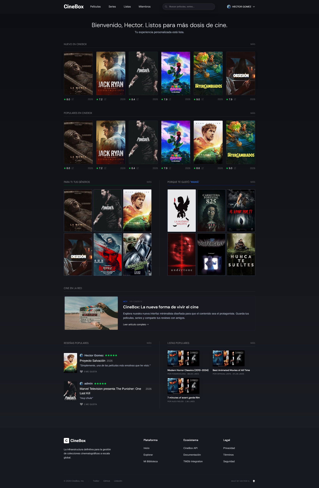

<div align="center">
  
  
  # 🎬 CineSaaS (App de Películas)

  **Tu plataforma definitiva para descubrir, organizar y compartir tu pasión por el cine.**  
  Una experiencia de usuario impecable orientada a la comunidad, sin anuncios y enfocada en el *Product-Led Growth*.

  [](https://reactjs.org/)
  [](https://vitejs.dev/)
  [](https://tailwindcss.com/)
  [](https://nodejs.org/)
  [](https://expressjs.com/)
  [](https://www.mongodb.com/)
  [](https://www.themoviedb.org/)
  [](https://pnpm.io/)
</div>

<br />

CineSaaS es un proyecto Full-Stack desarrollado como un monorepo, implementando una **Arquitectura de Microservicios** robusta y escalable. Su diseño oscuro, moderno y minimalista se inspira en las principales plataformas de *streaming* y Letterboxd, ofreciendo funcionalidades sociales avanzadas y un catálogo actualizado en tiempo real.

---

## 📋 Tabla de Contenidos

- [✨ Características Destacadas](#-características-destacadas)
- [📸 Galería y Demostración](#-galería-y-demostración)
- [🏗️ Arquitectura y Microservicios](#️-arquitectura-y-microservicios)
- [🛠️ Stack Tecnológico](#️-stack-tecnológico)
- [🚀 Instalación Local](#-instalación-local)
- [🔮 Roadmap](#-roadmap)

---

## ✨ Características Destacadas

*   **Catálogo en Tiempo Real:** Integración con la API de TMDb para acceder a información actualizada sobre películas, series, actores, trailers y tendencias en español.
*   **Gestión de Colecciones:** Crea listas personalizadas (públicas o privadas), marca contenido como "visto", y mantén una "Watchlist" al día.
*   **Comunidad y Reseñas:** Valora obras con un sistema de estrellas detallado, escribe críticas y compártelas con la comunidad.
*   **Búsqueda Avanzada:** Motor de búsqueda inteligente con filtros dinámicos (género, año, puntuación, plataforma de streaming).
*   **Experiencia de Usuario (UX) Premium:** Modo oscuro nativo, animaciones fluidas con Framer Motion, diseño 100% *responsive* y un enfoque total en la retención de usuarios.

---

## 📸 Galería y Demostración

> **💡 Nota:** Reemplaza los enlaces `src` con las URLs reales de tus imágenes o GIFs alojados en tu repositorio o plataformas como Imgur/Giphy.

### 🎥 Demo Interactivo (GIF / Video)
*Muestra de la navegación fluida, transiciones y experiencia de usuario.*
<div align="center">
  
</div>

<br/>

### 🖥️ Capturas de Pantalla

| **🏠 Página de Inicio (Dashboard)** | **🔍 Explorador y Filtros** |
| :---: | :---: |
|  |  |
| *Estrenos, tendencias y recomendaciones.* | *Búsqueda avanzada con autocompletado y filtros.* |

| **🎬 Detalles de Película/Serie** | **👤 Perfil y Listas Personalizadas** |
| :---: | :---: |
|  |  |
| *Trailers, reparto, sinopsis y reseñas de la comunidad.* | *Tu biblioteca personal, actividad y estadísticas.* |

---

## 🏗️ Arquitectura y Microservicios

El proyecto utiliza un enfoque de **Monorepo gestionado con pnpm workspaces**, separando claramente la lógica de negocio en backend mediante microservicios independientes, facilitando futuros despliegues Serverless o en contenedores Docker.

1.  **Auth Service (`:5001`):** Autenticación JWT, gestión de perfiles, encriptación Bcrypt y roles.
2.  **Movie Service (`:5002`):** Proxy/Caché para la API de TMDb. Optimiza las llamadas externas y centraliza los datos del catálogo.
3.  **Watchlist Service (`:5003`):** Gestiona la biblioteca personal del usuario (pendientes, vistas, listas custom).
4.  **Review Service (`:5004`):** Centraliza la interacción social, comentarios, puntuaciones y *likes*.

---

## 🛠️ Stack Tecnológico

**Frontend:**
*   **Framework:** React 18 + Vite
*   **Estilos:** Tailwind CSS + Framer Motion (Animaciones UI)
*   **Estado y Peticiones:** Context API + Axios
*   **Navegación:** React Router v6

**Backend (Microservicios):**
*   **Entorno:** Node.js + Express
*   **Base de Datos:** MongoDB Atlas + Mongoose
*   **Seguridad:** JSON Web Tokens (JWT), Middlewares de autorización y validación.

**Herramientas y DevOps:**
*   **Gestor de Paquetes:** pnpm (Workspaces)
*   **Contenedores:** Docker & Docker Compose (Despliegue unificado)

---

## 🚀 Instalación Local

### Prerrequisitos
*   [Node.js](https://nodejs.org/) (v18 o superior)
*   [pnpm](https://pnpm.io/installation) (Gestor de paquetes recomendado para este monorepo)
*   Cuenta en [TMDb](https://www.themoviedb.org/documentation/api) para obtener tu API Key gratuita.
*   Instancia local de MongoDB o clúster en MongoDB Atlas.

### Pasos de Configuración

**1. Clonar el repositorio:**
```bash
git clone https://github.com/TuUsuario/cine-saas.git
cd cine-saas
```

**2. Instalar todas las dependencias del monorepo:**
```bash
pnpm install
```

**3. Variables de Entorno:**
Deberás configurar los archivos `.env` basándote en los `.example` proporcionados en cada directorio.
*   En `frontend/.env`: `VITE_TMDB_API_KEY`, etc.
*   En cada microservicio de `backend/*/.env`: `MONGO_URI`, `JWT_SECRET`, `PORT`, etc.

**4. Ejecutar el proyecto:**
Gracias a pnpm workspaces o herramientas como concurrently, puedes levantar todo (o usar Docker):

*Opción A: Levantar Frontend localmente*
```bash
cd frontend
pnpm dev
```

*Opción B: Levantar toda la infraestructura con Docker (Recomendado)*
```bash
docker-compose up -d --build
```

---

## 🔮 Roadmap

- [x] Arquitectura base de microservicios.
- [x] Integración TMDb y UI responsive.
- [x] Sistema de Autenticación y JWT.
- [x] Listas personalizadas y sistema de reseñas.
- [ ] **Funciones Sociales:** Seguir usuarios, feed de actividad en tiempo real.
- [ ] **Despliegue AWS:** Migración de microservicios a Lambda / API Gateway.
- [ ] **Soporte PWA:** Instalable como aplicación nativa en dispositivos móviles.

---

<div align="center">
  <i>Desarrollado con pasión por el cine y la tecnología limpia.</i>
</div>
